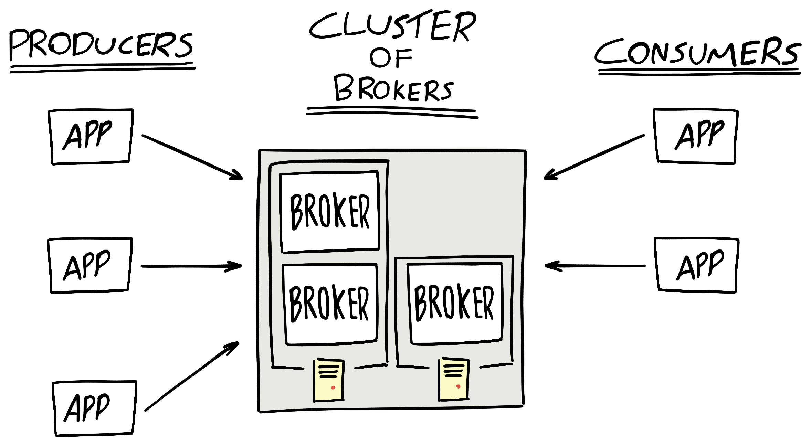

# Kafka

Kafka has three main parts:

### Producer

Producers put messages onto a topic

* Producer can decide on the binary payload of the message
* Designed to be loosely coupled
* Can produce messages at their own rate 

### Consumer

* Can consume messages at their own rate
* Designed to be loosely coupled

### Brokers

* Building block of Kafka cluster
* Distributed across many brokers
* Also known as a 'server' or 'node'
* Receives messages from Producers and stored them on disk keyed by unique offset
* Allows consumers to fetch messages by topic, partition and offset
* Every cluster has exactly one broker that is designated as the Controller
* Flexible publish-subscribe semantics

